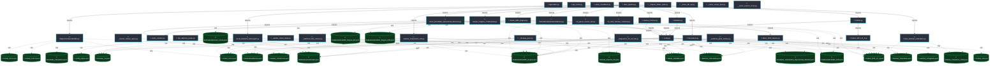

# 🗺️ Mapa de Fluxo do Aplicativo

Este diagrama foi gerado automaticamente pela análise estática dos scripts.

```mermaid
graph TD
    classDef script fill:#2b313c,stroke:#00d4ff,stroke-width:2px,color:#fff;
    classDef data fill:#0d381e,stroke:#22c55e,stroke-width:2px,color:#fff;
    classDef ext fill:#382b0d,stroke:#ffab00,stroke-width:2px,color:#fff;
    S_Agendador_py["📄 Agendador.py"]:::script
    S_analisar_rompimento_10h_py["📄 analisar_rompimento_10h.py"]:::script
    S_analisar_rompimento_10h_py -.->|usa| D_Dados_MT5_v2_2_json
    S_analisar_rompimento_10h_py -.->|usa| D_DadosAtivosUnificados_json
    S_analisar_rompimento_10h_py -.->|usa| D_EstimativaAbertura_json
    S_analisar_rompimento_10h_py -.->|usa| D_Metricas_Calculadas_json
    S_analisar_rompimento_10h_py -.->|usa| D_AnaliseGraficaSMC_Regras_json
    S_analisar_rompimento_10h_py -.->|usa| D_Decisao_V2_json
    S_Analise_Noticias_py["📄 Analise_Noticias.py"]:::script
    S_Analise_Noticias_py -->|importa| S_config_py
    S_app_home_py["📄 app_home.py"]:::script
    S_ativar_cloudflared_py["📄 ativar_cloudflared.py"]:::script
    S_cache_candles_py["📄 cache_candles.py"]:::script
    S_Calculadora_py["📄 Calculadora.py"]:::script
    S_Calculadora_py -.->|usa| D_Dados_Validados_json
    S_Calculadora_py -.->|usa| D_Metricas_Calculadas_json
    S_CalculadoraEstimativaAbertura_py["📄 CalculadoraEstimativaAbertura.py"]:::script
    S_CalculadoraEstimativaAbertura_py -->|importa| S_config_py
    S_CalculadoraEstimativaAbertura_py -.->|usa| D_Dados_MT5_v2_2_json
    S_CalculadoraEstimativaAbertura_py -.->|usa| D_AnaliseGraficaSMC_Regras_json
    S_CalculadoraEstimativaAbertura_py -.->|usa| D_EstimativaAbertura_Cache_json
    S_Coleta_Noticias_Calendario_py["📄 Coleta_Noticias_Calendario.py"]:::script
    S_Coleta_Noticias_Calendario_py -.->|usa| D_Noticias_Calendario_json
    S_Coleta_Noticias_Calendario_py -.->|usa| D_Noticias_Calendario_0900_json
    S_Coletor_py["📄 Coletor.py"]:::script
    S_Coletor_py -->|importa| S_config_py
    S_Coletor_py -->|importa| S_Coletor_MT5_v2_2_py
    S_Coletor_MT5_v2_2_py["📄 Coletor_MT5_v2_2.py"]:::script
    S_Coletor_MT5_v2_2_py -.->|usa| D_Dados_MT5_v2_2_json
    S_config_py["📄 config.py"]:::script
    S_config_py -.->|usa| D_Coleta_ram_json
    S_config_py -.->|usa| D_Resultado_Calculadora_Operacional_Abertura_json
    S_config_py -.->|usa| D_Dados_MT5_v2_2_json
    S_config_py -.->|usa| D_DadosAtivosUnificados_json
    S_config_py -.->|usa| D_AnaliseGraficaSMC_Regras_json
    S_config_py -.->|usa| D_EstimativaAbertura_json
    S_config_py -.->|usa| D_Dados_Validados_json
    S_config_py -.->|usa| D_LastTick_Congelado_json
    S_config_py -.->|usa| D_Noticias_Calendario_0900_json
    S_config_py -.->|usa| D_Metricas_Calculadas_json
    S_config_py -.->|usa| D_AnaliseGraficaSMC_MTF_json
    S_config_py -.->|usa| D_Decisao_V2_json
    S_config_py -.->|usa| D_Noticias_Impacto_Dia_json
    S_config_py -.->|usa| D_Analise_Tendencias_json
    S_config_py -.->|usa| D_Noticias_Calendario_json
    S_Gerar_Relatorio_Mensagem_py["📄 Gerar_Relatorio_Mensagem.py"]:::script
    S_Gerar_Relatorio_Mensagem_py -.->|usa| D_Resultado_Calculadora_Operacional_Abertura_json
    S_Gerar_Relatorio_Mensagem_py -.->|usa| D_DadosAtivosUnificados_json
    S_Gerar_Relatorio_Mensagem_py -.->|usa| D_EstimativaAbertura_json
    S_Gerar_Relatorio_Mensagem_py -.->|usa| D_Resultado_Calculadora_json
    S_Gerar_Relatorio_Mensagem_py -.->|usa| D_AnaliseGraficaSMC_Regras_json
    S_Gerar_Relatorio_Mensagem_py -.->|usa| D_Decisao_V2_json
    S_Gerar_Resultado_Operacional_Abertura_py["📄 Gerar_Resultado_Operacional_Abertura.py"]:::script
    S_Gerar_Resultado_Operacional_Abertura_py -->|importa| S_config_py
    S_Gerar_Resultado_Operacional_Abertura_py -->|importa| S_cache_candles_py
    S_Gerar_Resultado_Operacional_Abertura_py -.->|usa| D_AnaliseGraficaSMC_Regras_M1_json
    S_Gerar_Resultado_Operacional_Abertura_py -.->|usa| D_AnaliseGraficaSMC_Regras_M15_json
    S_Gerar_Resultado_Operacional_Abertura_py -.->|usa| D_AnaliseGraficaSMC_Regras_json
    S_Gerar_Resultado_Operacional_Abertura_py -.->|usa| D_Noticias_Impacto_Dia_json
    S_Gerar_Resultado_Operacional_Abertura_py -.->|usa| D_AnaliseGraficaSMC_MTF_json
    S_Limpar_Imagens_TradingView_py["📄 Limpar_Imagens_TradingView.py"]:::script
    S_main_pipeline_py["📄 main_pipeline.py"]:::script
    S_main_pipeline_py -->|importa| S_Limpar_Imagens_TradingView_py
    S_main_pipeline_py -->|importa| S_Coletor_py
    S_main_pipeline_py -->|importa| S_Coleta_Noticias_Calendario_py
    S_main_pipeline_py -->|importa| S_Analise_Noticias_py
    S_main_pipeline_py -->|importa| S_Validador_py
    S_main_pipeline_py -->|importa| S_Rodar_SMC_Regras_py
    S_main_pipeline_py -->|importa| S_Calculadora_py
    S_main_pipeline_py -->|importa| S_CalculadoraEstimativaAbertura_py
    S_main_pipeline_py -->|importa| S_Gerar_Resultado_Operacional_Abertura_py
    S_main_pipeline_py -->|importa| S_Gerar_Relatorio_Mensagem_py
    S_main_pipeline_py -->|importa| S_v2_gravar_sessao_win_py
    S_main_pipeline_py -->|importa| S_v2_rodar_decisao_completa_py
    S_main_pipeline_py -->|importa| S_MapearTendencia15Min_py
    S_main_pipeline_py -->|importa| S_analisar_rompimento_10h_py
    S_MapearTendencia15Min_py["📄 MapearTendencia15Min.py"]:::script
    S_MapearTendencia15Min_py -.->|usa| D_Coleta_rom_10_json
    S_MapearTendencia15Min_py -.->|usa| D_Coleta_rom_0_json
    S_MapearTendencia15Min_py -.->|usa| D_Analise_Tendencias_json
    S_MapearTendencia15Min_py -.->|usa| D_Coleta_rom_5_json
    S_Motor_SMC_Regras_py["📄 Motor_SMC_Regras.py"]:::script
    S_Motor_SMC_Regras_py -.->|usa| D_Dados_MT5_v2_2_json
    S_Motor_SMC_Regras_py -.->|usa| D_AnaliseGraficaSMC_Regras_json
    S_Motor_SMC_Regras_py -.->|usa| D_Metricas_Calculadas_json
    S_Rodar_SMC_Regras_py["📄 Rodar_SMC_Regras.py"]:::script
    S_Rodar_SMC_Regras_py -->|importa| S_cache_candles_py
    S_Rodar_SMC_Regras_py -->|importa| S_Motor_SMC_Regras_py
    S_Rodar_SMC_Regras_py -.->|usa| D_AnaliseGraficaSMC_Regras_M1_json
    S_Rodar_SMC_Regras_py -.->|usa| D_AnaliseGraficaSMC_Regras_M15_json
    S_Rodar_SMC_Regras_py -.->|usa| D_AnaliseGraficaSMC_Regras_json
    S_Rodar_SMC_Regras_py -.->|usa| D_AnaliseGraficaSMC_MTF_json
    S_v2_gravar_sessao_win_py["📄 v2_gravar_sessao_win.py"]:::script
    S_v2_rodar_decisao_completa_py["📄 v2_rodar_decisao_completa.py"]:::script
    S_Validador_py["📄 Validador.py"]:::script
    S_Validador_py -->|importa| S_config_py
    S_win_abertura_sniper_py["📄 win_abertura_sniper.py"]:::script
    S_win_abertura_sniper_py -.->|usa| D_AnaliseGraficaSMC_Regras_json
    S_win_abertura_sniper_py -.->|usa| D_config_regiao_json
    S_win_abertura_sniper_py -.->|usa| D_DadosAtivosUnificados_json
    S__auditar_coleta_dupla_py["📄 _auditar_coleta_dupla.py"]:::script
    S__auditar_coleta_dupla_py -.->|usa| D_Dados_Validados_json
    S__auditar_coleta_dupla_py -.->|usa| D_Coleta_rom_0_json
    S__auditoria_final_coletas_py["📄 _auditoria_final_coletas.py"]:::script
    S__auditoria_final_coletas_py -.->|usa| D_Dados_Validados_json
    S__auditoria_final_coletas_py -.->|usa| D_Coleta_rom_0_json
    S__auditoria_geral_coletas_py["📄 _auditoria_geral_coletas.py"]:::script
    S__auditoria_geral_coletas_py -.->|usa| D_Dados_MT5_v2_2_json
    S__auditoria_geral_coletas_py -.->|usa| D_Coleta_rom_0_json
    S__auditoria_geral_coletas_py -.->|usa| D_Dados_Validados_json
    S__auditoria_geral_coletas_py -.->|usa| D_Noticias_Impacto_Dia_json
    S__auditoria_geral_coletas_py -.->|usa| D_Noticias_Calendario_json
    S__checar_coletas_agora_py["📄 _checar_coletas_agora.py"]:::script
    S__checar_coletas_agora_py -.->|usa| D_Coleta_rom_0_json
    S__checar_coletas_agora_py -.->|usa| D_DadosAtivosUnificados_json
    S__checkup_geral_py["📄 _checkup_geral.py"]:::script
    S__checkup_geral_py -.->|usa| D_Dados_MT5_v2_2_json
    S__checkup_geral_py -.->|usa| D_DadosAtivosUnificados_json
    S__checkup_geral_py -.->|usa| D_Decisao_V2_json
    S__checkup_geral_py -.->|usa| D_EstimativaAbertura_json
    S__checkup_geral_py -.->|usa| D_Metricas_Calculadas_json
    S__checkup_geral_py -.->|usa| D_AnaliseGraficaSMC_Regras_json
    S__checkup_geral_py -.->|usa| D_Analise_Tendencias_json
    S__diagnostico_S1_S4_S5_py["📄 _diagnostico_S1_S4_S5.py"]:::script
    S__diagnostico_S1_S4_S5_py -.->|usa| D_Dados_MT5_v2_2_json
    S__diagnostico_S1_S4_S5_py -.->|usa| D_Dados_Validados_json
    S__diagnostico_S1_S4_S5_py -.->|usa| D_AnaliseGraficaSMC_Regras_json
    S__diagnostico_S1_S4_S5_py -.->|usa| D_DadosAtivosUnificados_json
    S__mapear_dados_spike_py["📄 _mapear_dados_spike.py"]:::script
    S__testar_adr_api_py["📄 _testar_adr_api.py"]:::script
    S__varrer_except_pass_py["📄 _varrer_except_pass.py"]:::script
    S___testar_session_close_py["📄 __testar_session_close.py"]:::script
    D_DadosAtivosUnificados_json[("💾 DadosAtivosUnificados.json")]:::data
    D_EstimativaAbertura_json[("💾 EstimativaAbertura.json")]:::data
    D_AnaliseGraficaSMC_Regras_json[("💾 AnaliseGraficaSMC_Regras.json")]:::data
    D_Noticias_Impacto_Dia_json[("💾 Noticias_Impacto_Dia.json")]:::data
    D_Analise_Tendencias_json[("💾 Analise_Tendencias.json")]:::data
    D_Decisao_V2_json[("💾 Decisao_V2.json")]:::data
    D_Noticias_Calendario_json[("💾 Noticias_Calendario.json")]:::data
    D_Coleta_ram_json[("💾 Coleta_ram.json")]:::data
    D_Resultado_Calculadora_Operacional_Abertura_json[("💾 Resultado_Calculadora_Operacional_Abertura.json")]:::data
    D_Dados_MT5_v2_2_json[("💾 Dados_MT5_v2_2.json")]:::data
    D_Coleta_rom_0_json[("💾 Coleta_rom-0.json")]:::data
    D_Coleta_rom_10_json[("💾 Coleta_rom-10.json")]:::data
    D_Dados_Validados_json[("💾 Dados_Validados.json")]:::data
    D_Resultado_Calculadora_json[("💾 Resultado_Calculadora.json")]:::data
    D_AnaliseGraficaSMC_MTF_json[("💾 AnaliseGraficaSMC_MTF.json")]:::data
    D_config_regiao_json[("💾 config_regiao.json")]:::data
    D_LastTick_Congelado_json[("💾 LastTick_Congelado.json")]:::data
    D_Metricas_Calculadas_json[("💾 Metricas_Calculadas.json")]:::data
    D_EstimativaAbertura_Cache_json[("💾 EstimativaAbertura_Cache.json")]:::data
    D_Coleta_rom_5_json[("💾 Coleta_rom-5.json")]:::data
    D_AnaliseGraficaSMC_Regras_M1_json[("💾 AnaliseGraficaSMC_Regras_M1.json")]:::data
    D_AnaliseGraficaSMC_Regras_M15_json[("💾 AnaliseGraficaSMC_Regras_M15.json")]:::data
    D_Noticias_Calendario_0900_json[("💾 Noticias_Calendario_0900.json")]:::data
```