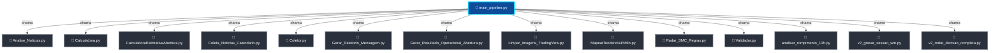

# 🗺️ Mapa Focado: main_pipeline.py

O arquivo `main_pipeline.py` atua como maestro, chamando os seguintes módulos:

```mermaid
graph TD
    classDef main fill:#0e4b99,stroke:#00d4ff,stroke-width:3px,color:#fff;
    classDef script fill:#2b313c,stroke:#8b949e,stroke-width:2px,color:#fff;
    MAIN["🎯 main_pipeline.py"]:::main
    S_Analise_Noticias_py["📄 Analise_Noticias.py"]:::script
    MAIN -->|chama| S_Analise_Noticias_py
    S_Calculadora_py["📄 Calculadora.py"]:::script
    MAIN -->|chama| S_Calculadora_py
    S_CalculadoraEstimativaAbertura_py["📄 CalculadoraEstimativaAbertura.py"]:::script
    MAIN -->|chama| S_CalculadoraEstimativaAbertura_py
    S_Coleta_Noticias_Calendario_py["📄 Coleta_Noticias_Calendario.py"]:::script
    MAIN -->|chama| S_Coleta_Noticias_Calendario_py
    S_Coletor_py["📄 Coletor.py"]:::script
    MAIN -->|chama| S_Coletor_py
    S_Gerar_Relatorio_Mensagem_py["📄 Gerar_Relatorio_Mensagem.py"]:::script
    MAIN -->|chama| S_Gerar_Relatorio_Mensagem_py
    S_Gerar_Resultado_Operacional_Abertura_py["📄 Gerar_Resultado_Operacional_Abertura.py"]:::script
    MAIN -->|chama| S_Gerar_Resultado_Operacional_Abertura_py
    S_Limpar_Imagens_TradingView_py["📄 Limpar_Imagens_TradingView.py"]:::script
    MAIN -->|chama| S_Limpar_Imagens_TradingView_py
    S_MapearTendencia15Min_py["📄 MapearTendencia15Min.py"]:::script
    MAIN -->|chama| S_MapearTendencia15Min_py
    S_Rodar_SMC_Regras_py["📄 Rodar_SMC_Regras.py"]:::script
    MAIN -->|chama| S_Rodar_SMC_Regras_py
    S_Validador_py["📄 Validador.py"]:::script
    MAIN -->|chama| S_Validador_py
    S_analisar_rompimento_10h_py["📄 analisar_rompimento_10h.py"]:::script
    MAIN -->|chama| S_analisar_rompimento_10h_py
    S_v2_gravar_sessao_win_py["📄 v2_gravar_sessao_win.py"]:::script
    MAIN -->|chama| S_v2_gravar_sessao_win_py
    S_v2_rodar_decisao_completa_py["📄 v2_rodar_decisao_completa.py"]:::script
    MAIN -->|chama| S_v2_rodar_decisao_completa_py
```